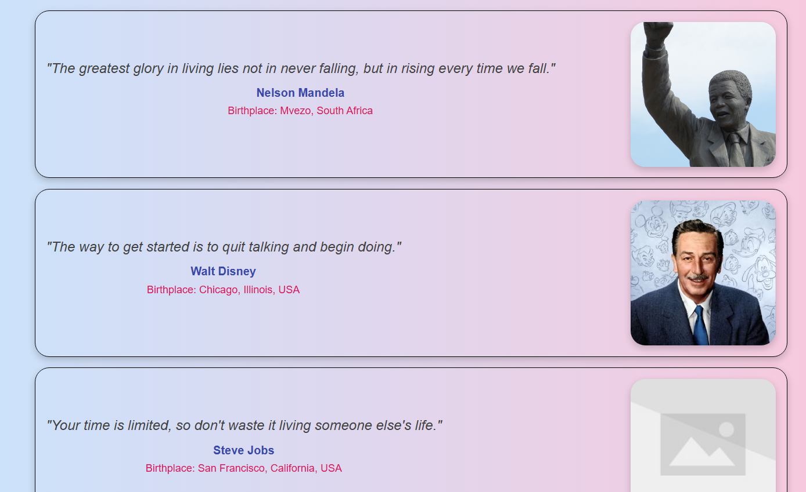

Features : 
Responsive Design: Cards adapt seamlessly to all screen sizes.
Dynamic Content: Cards are populated dynamically using JavaScript.
Bootstrap Integration: Utilizes Bootstrap 5 for grid layout and styling consistency.
Interactive Elements: Hover effects for an enhanced user experience.
Clean and Minimal UI: Focus on typography and spacing for readability.

Technologies Used :
HTML5: Semantic structure of the webpage.
CSS3: Custom styles for card design and layout.
JavaScript: Dynamic rendering of quote data.
Bootstrap 5: Grid system and utility classes.
CDN Images: Placeholder images hosted on external platforms.

Project Structure:

.
├── index.html         # Main HTML file
├── style.css          # Custom styles
├── script.js          # JavaScript for dynamic rendering
└── README.md          # Project description

![image](Features : 
Responsive Design: Cards adapt seamlessly to all screen sizes.
Dynamic Content: Cards are populated dynamically using JavaScript.
Bootstrap Integration: Utilizes Bootstrap 5 for grid layout and styling consistency.
Interactive Elements: Hover effects for an enhanced user experience.
Clean and Minimal UI: Focus on typography and spacing for readability.

Technologies Used :
HTML5: Semantic structure of the webpage.
CSS3: Custom styles for card design and layout.
JavaScript: Dynamic rendering of quote data.
Bootstrap 5: Grid system and utility classes.
CDN Images: Placeholder images hosted on external platforms.

Project Structure:

.
├── index.html         # Main HTML file
├── style.css          # Custom styles
├── script.js          # JavaScript for dynamic rendering
└── README.md          # Project description

;
